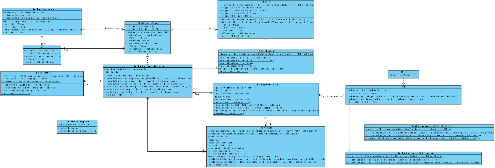

# :car: ParkingBuddy :blue_car:
Claire Lua [clua@seas.upenn.edu]

Samantha Lau [samlauj@seas.upenn.edu]

Min Choi [minschoi@seas.upenn.edu]


## Overview 
Parking is a scarce resource in many neighborhoods. As such, neighborhoods have parking policies to limit the number of times each vehicle can park at the neighborhood. Tracking the vehicles parked at a parking lot is manually-intensive work, as the enforcement volunteer must manually log the license plates and dates of every vehicle parked in a complex and determine the violations. 

Parking Buddy is a parking tracking application that makes use of OpenALPR, an open-source OCR library, to help parking enforcement officers automatically recognize license plates. A SQLite database is also used to track the number of times each vehicle is parked at a parking garage over a period of time.

Parking Buddy has 2 main functionalities - upload photos, or view parking report. 

1) To upload photos, the parking enforcement officer could choose to upload photos from folder or files. When photos are uploaded, the OpenALPR API is used to automatically detect the license plate of the vehicle in each photo. These parking instances are then stored in an SQLite database.

2) There is also a parking report viewer, where the officer can select a date range, and get a summary aggregate table view of vehicles, and the number of times that each vehicle were parked overnight. A common problem with parking enforcement is that owners may ask for proof that the vehicle had been parked overnight. As such, when the officier taps on each car’s row in the report, it will expand to display the photos and times of each time the car is parked overnight in the selected date period.


#### Parking Rules
- Restrictions are placed on the number of times that a vehicle can be parked overnight.
- Overnight parking is defined as parking between the hours of 8.00pm to 6.00am.

## Set up
### Running pre-compiled binary

1) Go to Releases
2) Download Parking.jar
3) Go into command line to run the jar file
```sh
java -jar Parking.jar 
```

### Building from source
#### Clone
Clone this repo to your local machine using `https://github.com/UPenn-CIT599/final-project-team75_parkingbuddy.git`

#### Commands
Run the gradle project to ensure all dependencies are loaded
```sh
cd src
./gradlew run
```

Build and test
```sh
cd src
./gradlew build
```

Create Jar file
```
cd src
./gradlew jar
java -jar build/libs/Parking.jar 
```
___
## Usage

When ParkingBuddy is run, the following window is launched: 


### User Actions

There are 2 actions the user can take: 

**1. Upload Photos**
* This can be done either via a Folder upload or uploading individual image files. When photos are uploaded, the OpenALPR API is used to automatically detect the license plate of the vehicle in each photo.
* A new window displays a table confirming the parking instances that have been parsed from the image files and uploaded to the database


**2. Generate Report**
* The user must specify a date range (e.g. the week of May 13-19) by using the calendar function to input a start and end date
* The program outputs a table containing aggregated parking data over the inputted date range; the `Count` represents the number of instances the particular car has parked overnight within the specified date range
* Helps to easily determine violations for the following parking rule: `No overnight parking for more than 3 nights in a 7-day period` (in this case, no car has violated this rule!)


## Design

### UI Mock


### Class Diagram


___
## Design Milestone
### Class Design 
Our class design with the relevant methods for each class can be seen from the following diagram:


### Non-trivial Method and JUnit Test:

- readDates() method in [JPEGReader.java](/src/src/main/java/Parking/JPEGReader.java): This method extracts the original date of the image files from a folder by extracting exif data, converting the date strings into LocalDateTime objects, and storing them in an ArrayList<LocalDateTime>
- Various unit tests in [JPEGReaderTest.java](/src/src/test/java/Parking/JPEGReaderTest.java)
